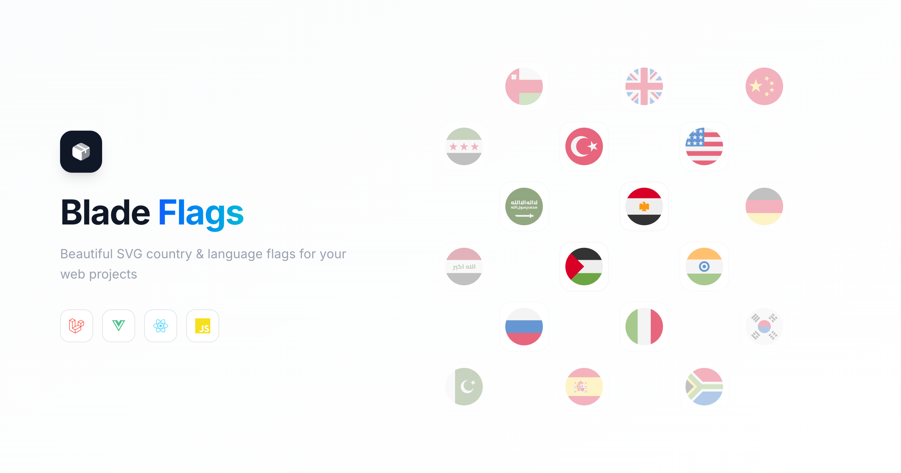

<p align="center">
    
</p>

# Blade Flags For Countries & Languages

<a href="https://github.com/MohmmedAshraf/blade-flags/actions?query=workflow%3ATests">
    
</a>
<a href="https://github.styleci.io/repos/539659619">
    
</a>
<a href="https://packagist.org/packages/outhebox/blade-flags">
    
</a>
<a href="https://packagist.org/packages/outhebox/blade-flags">
    
</a>

A package to easily make use of [TwEmoji Countries & Languages Flags](https://github.com/twitter/twemoji) in your Laravel Blade views.

For a full list of available icons see [the SVG directory](resources/svg) or preview all the available flags, check [the gallery](https://github.com/twitter/twemoji).

## Requirements

- PHP 8.0 or higher
- Laravel 9.0 or higher

## Installation

```bash
composer require outhebox/blade-flags
```

## Blade Icons

Blade Flags uses Blade Icons under the hood. Please refer to [the Blade Icons readme](https://github.com/blade-ui-kit/blade-icons) for additional functionality. We also recommend to [enable icon caching](https://github.com/blade-ui-kit/blade-icons#caching) with this library.

## Configuration

Blade Flags also offers the ability to use features from Blade Icons like default classes, default attributes, etc. If you'd like to configure these, publish the `blade-flags.php` config file:

```bash
php artisan vendor:publish --tag=blade-flags-config
```

## Usage

Icons can be used as self-closing Blade components which will be compiled to SVG icons:

```blade
<x-flag-country-br />
<x-flag-country-cn />
<x-flag-country-gb />
<x-flag-country-ru />
<x-flag-country-us />
```

...produces this:<br/><br/>


```blade
<x-flag-language-en />
<x-flag-language-ar />
<x-flag-language-es />
```

...produces this:<br/><br/>


You can also pass classes to your icon components:

```blade
<x-flag-country-us class="w-6 h-6 text-gray-500"/>
```

And even use inline styles:

```blade
<x-flag-country-us style="color: #555"/>
```

Or use the `@svg` directive:

```blade
@svg('flag-country-us', 'w-6 h-6', ['style' => 'color: #555'])
```

### Raw SVG Icons

If you want to use the raw SVG icons as assets, you can publish them using:

```bash
php artisan vendor:publish --tag=blade-flags --force
```

Then use them in your views like:

```blade

```

```blade

```

## Changelog

Check out the [CHANGELOG](CHANGELOG.md) in this repository for all the recent changes.

## License

Blade Flags is open-sourced software licensed under [the MIT license](LICENSE.md).